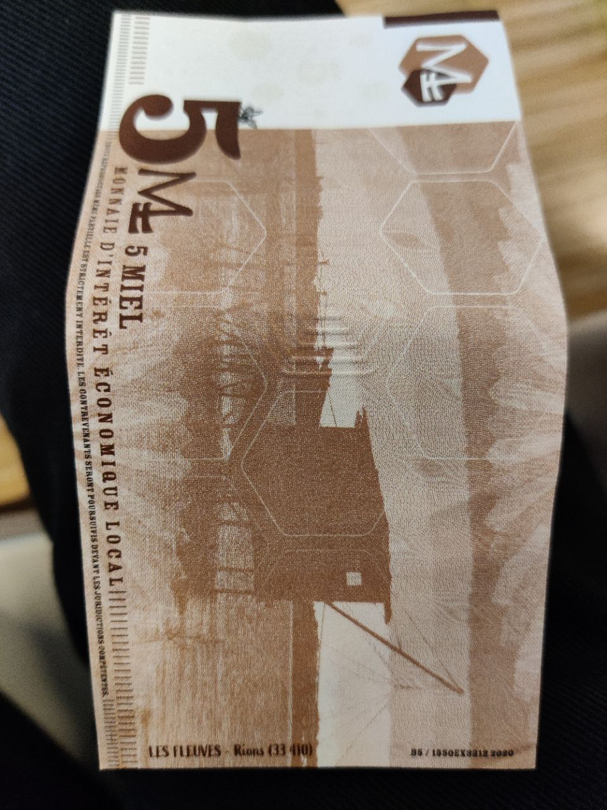

# Monnaies locales
*Yannick Lung et Stéphan Sainléger*

## Logiciels libres pour les monnaies locales de Nouvelle Aquitaine

- Monnaie = lien social
- Historiquement c'est le roi qui impose la valeur de la monnaie
- Monnaie en or peut être grattée et fondue
- La banque gère la monnaie et est à l'origine de l'essentiel de la création monétaire
- 98% des echanges sont virtuels, sans argent physique
- En France les monnaies locales sont dites complémentaires :
    - Loi ESS (concerne les assos, les coops, les fondations et les mutuelles)
    - 1 unité de monnaie locale vaut 1€
- Début en 2010
- Contribue au développement économique du territoire
- Participer à la transition environnementale
- Renforcer le lien social
    - Sert à faire vivre les petits commerces car les gens sont plus ammenés à payer en vrai qu'en virtuel avec les GAFAM
- Eusko (pays basque) T1nda (Béarn) sont les plus importantes
### LokaValuto
- Suite de logiciels opensource
- Gouvernance partagée
- 3 pôles : implémentation, développement, communauté
- Objectifs :
    - Outils 100% libres
    - Kit d'outils efficaces et moins rébarbatifs
    - Indépendant des GAFAM
    - Volonté de former et de transmettre
- Valeurs :
    - Sécurité
    - Appui sur l'existant
    - Mutualiser les compétences informatiques
- Problèmes :
    - Avant, trop de DBs
    - Utilisation de rocket.chat, odoo community, bigbluebutton, nextcloud -> une seule bd
- Utilise Cyclos payment software et Biletujo
- Souhaite une v1 lancée début 2022

