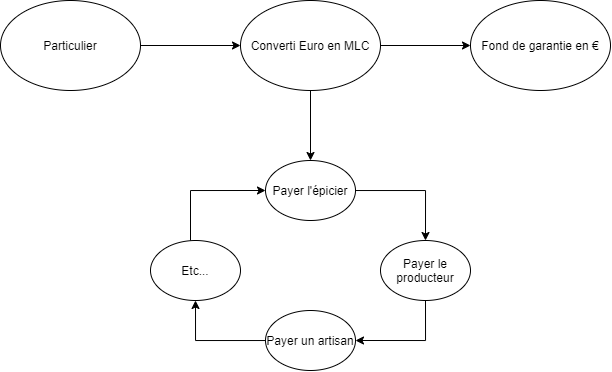

# BCO1 : Des logiciels libres pour les monnaies locales de Nouvelle Aquitaine

Résumé/notes par Erwann BLOT

## Intervenants : 

- Yannick LUNG (Université de Bordeaux et association la MIEL)
- Stéphan SAINLEGER (Lokavaluto  et association la MIEL)

## 1 - La monnaie

La monnaie est un moyen d'échange de bien et services. Elle permet également de créer un lien social entre les personnes.

**Historiquement** la monnaie était la responsabilité de l'état (représenté par le Roi) puis cette responsabilité à migrer vers la banque centrale. Au fur et à mesure du temps la banque centrale c'est éloignée du pouvoir en place tout en gardant une gestion de la monnaie par l'état.

**De nos jours** la création de monnaie est gérée par des banques **privées** qui possède des techniques de garantie. 

98% des échanges effectués sont financiers

L'argent n'a pas de propriétaires -> sont but est de circuler

## 2 - La monnaie locale

La monnaie locale contrairement à la monnaie nationale est perçue comme un bien commun

**Loi de l'ESS** -> reconnait les monnaies locales et les renomment monnaies locales complémentaires (MLC) et garantie également sa parité avec l'euro ( 1 euro = 1 MLC)

Image 1 - exemple de circuit de MLC

22 MLC en France (2021) : cela représente 4.5 millions d'euro en circulation en MLC.

Les MLC on commencées en 2010

Cela permet un développement économique du territoire car les MLC favorisent un fonctionnement en circuits courts ainsi que de renforcer le lien social au niveau local.

Permet également de participer à la transition environnementale (monnaie "classiques" sont extrêmement polluantes)

Les MLC sont également engagées dans la transition numérique -> informatisation des monnaies (payements numériques)

## 3 - Lokavaluto

Association fondée et dirigée par les monnaies locales

Suite de logiciels Open Source 

Permet une réponse à des besoins concernant les monnaies locales -> création d'outils

Aide au déploiement d'un écosystème

formation, entra-aide, partage

Outils pour éviter les tâches rébarbative 

OS -> outils 100% libres 

permet une indépendances des GAFAM 

hébergés sur des serveurs utilisateurs

sécurité avant tout 

Ne veut pas recréer des logiciels -> utilisation privilégiés d'outils existant 

Objectif : 100% d'autonomie 

Tous les acteurs sont des bénévoles de MLC 

Mutualisation des coûts de développements 

Seuls tarifs : 

- installation des outils
- migration et formation
- support continu 

