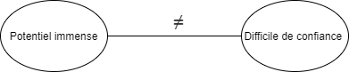

# Initiative responsable Labelia : "IA responsable et de confiance"

Résumé/notes par Erwann BLOT

Programme depuis 2019

Label : "IA responsable et de confiance"

### Contexte  : 

2 tendances se percutent pour l'IA

Exemples de problème avec l'IA : 

- Apple card (plafond sexiste)
- Facebook (personne noir confondues avec des singes)

## L'IA à besoin d'un cadre !

chartes, serments, guides existent déjà mais ca amène à rien.

### Ambition : 

- référentiel -> utile, pragmatique et actionnable
- B-corp -> cadre de référence pour les expériences responsable

Section 1 du label : 

- protéger les données
- prévenir les biais
- évaluer la performance
- assurer la reproductibilité des modèles 
- utiliser des modèles en confiance et de manière responsable 
- anticiper, suivre et minimaliser les externalités négative de l'activité data science

## La plateforme évaluation

Plateforme web simple depuis avril 2020. La plateforme à investi plus de 200 personnes.jours.

Fonctionnalités : 

- Compte organisation et comptes utilisateurs rattachés à une organisation
- Gestion de plusieurs versions d'un référentiel d'évaluation, migration des évaluations existantes (complétés ou en cours) vers la version la plus récente avec conservation des réponses et note des éléments inchangés, journal des changements
- Référencement de ressources-clés liées à chaque élément d'évaluation, qui peuvent être "mises en favori" et retrouvées au niveau du compte utilisateur
- Prise de notes liées à chaque élément d'évaluation, visibles par les utilisateurs rattachés à une même organisation 
- Ajout de justifications pour chaque éléments d'évaluation
- Système de scoring prenant en compte la notion d'élément d'évaluation non pertinent pour une organisation donnée, score par section, synthèse d'exposition aux risques 
- export pdf des résultat d'une évaluation 
- Demande de labellisation en ligne, gestion du workflow de labellisation
- Hébergement en France, technologies standards, éprouvées et sécurisées