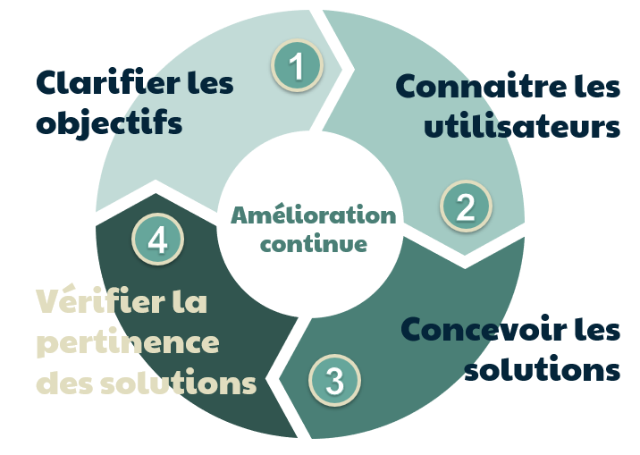

Focus Group
==========

Auteur : Sandy Verger

# Focus group

## Qu'est-ce qu'un Focus Group ?

Un Focus Group, ou groupe de discussion, est un groupe composé d’environ 5 à 10 membres soigneusement sélectionnés, dont un animateur qui modère le sens des conversations, dans le but de récolter les opinions et ressentis des utilisateurs à propos d’une fonctionnalité, d’un produit, d’une interface ou encore d’un service.

## D'où vient le Focus Group ?

Cette méthode a commencé à être proposée par des sociologues durant la seconde guerre mondiale sous forme de “Focus Interviews” permettant de saisir l’impact de la propagande radiophonique. Ainsi, des personnes sélectionnées devaient écouter les extraits et donner leur ressenti.
Cette méthode a donc été reprise pour comparer facilement des expériences et se concentrer sur des points précis ce que ne permettent pas les entretiens individuels ou l’observation.

## Quand fait-on le Focus Group ?
Ce processus intervient pendant la phase d’analyse du processus itératif d’idéation.

## Comment se passe cette méthode ?
On réunit 5 à 10 personnes selectionnées pour correspondre à la cible désirée pendant 60 à 120 min.

Les points abordés dépendent de l’objectif et sont choisis en amont, ils sont en général au nombre de 5 ou 6. Le but est de stimuler le sens critique et la créativité des participants via des discussions ou des activités.

Ainsi, les séances vont se dérouler globalement d’une même manière.
Tout d'abord en brisant la glace pour mettre à l’aise tout le monde avec diverses activités permettant de se présenter et d'interagir pour renforcer la cohésion de groupe.
Et ensuite avec une discussion ou activité.
La discussion peut permettre de faire réagir sur un nouveau design ou de connaître les motivations de l’utilisateur.
Et l’activité va permettre de concevoir une nouvelle interface avec des petits groupes qui vont pouvoir réaliser des maquettes de la meilleure interface selon eux et la montrer aux autres.

L'activité va aboutir a des prises de note de données subjectives contrairements aux données récoltées lors des tests utilisateurs.

## L'annimateur
L'annimateur a un rôle très important dans le processus. Il doit comprendre l’aspect technique du sujet, savoir gérer son temps, s’ajuster rapidement en fonction des discussions, savoir bien écouter, savoir aller chercher l’information avec des questions sans induire en erreur, inspirer la confiance, mettre à l’aise et savoir activer la participation.

