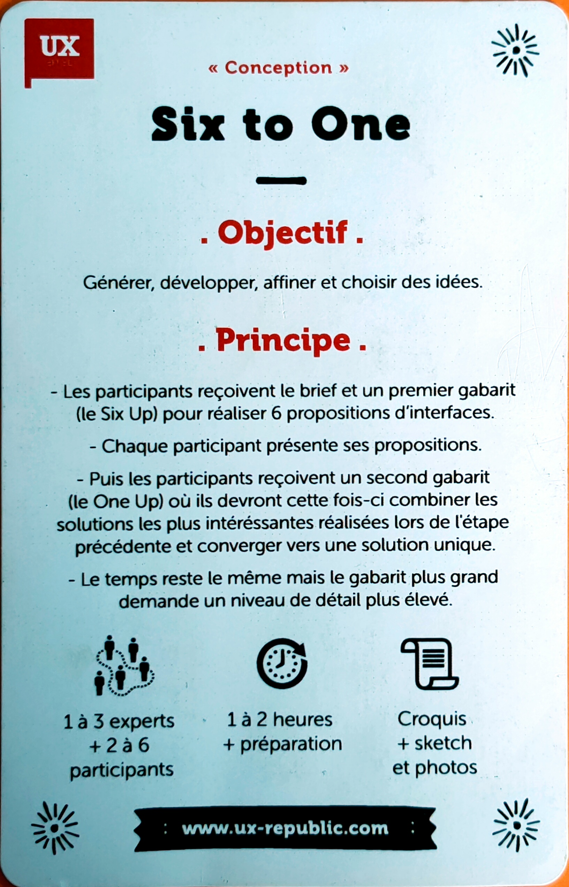
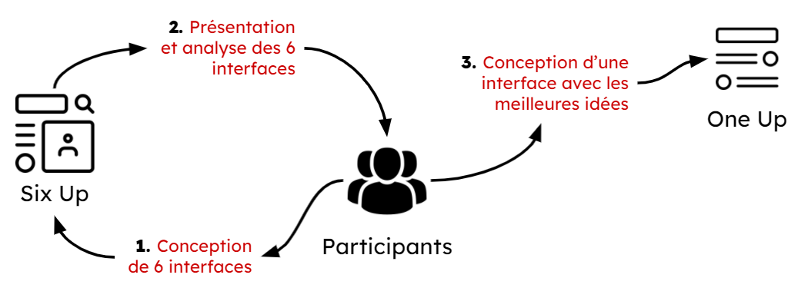
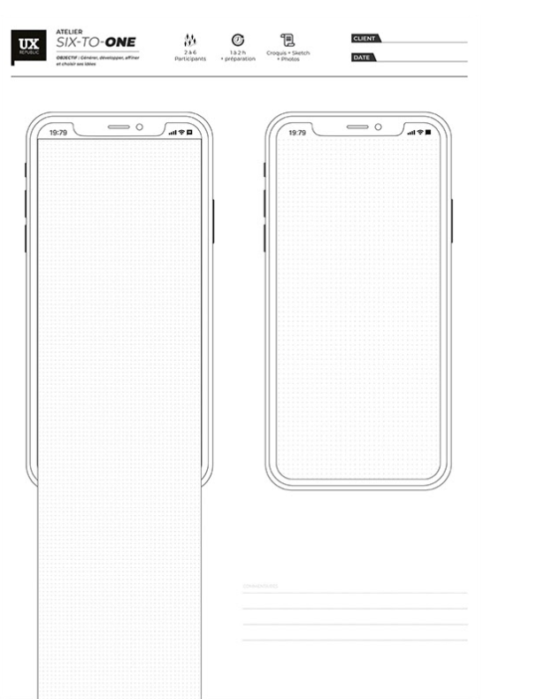
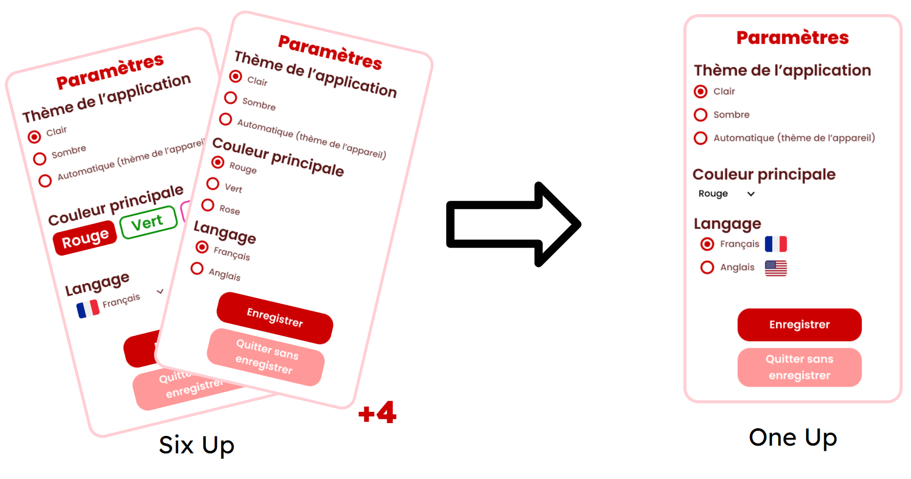

# Six To One - Conception

## Objectif

Générer, développer, affiner et choisir des idées.

## Principe

1 - Les participants réalisent 6 proposotions d’interface répondant à un même besoin, exemple une page paramètres(Six Up).

2 - Chaque participant présente ses propositions.

3 - Après la présentation de chaque proposition, les participants combinent les solutions pour réaliser une solution unique (One Up).

## A quoi ça sert ?

Cela permet d’exprimer plusieurs solutions pour une interface, de comparer les différentes solutions, et de retenir la plus adaptée.

## Exemple

### Définition des éléments d’interface

Un écran paramètres contenant :

- Choix du thème de l'application
- Choix de la couleur principale
- Choix de la langue

### Définition des contraintes

- Respecter la charte graphique
- etc ...

### Choix de l’outil

PDF disponible sur ux-republique à imprimer permettant de réaliser des maquettes sur papier

### Réalisation des interfaces

Une fois les 6 interfaces créées (Six Up), les participant gardent/fusionnent les meilleures idées pour obtenir la meilleure interface possible (One Up).

## Diaporama de présentation

[Six to One & Fly on the Wall.pdf](Six_to_One__Fly_on_the_Wall.pdf)

## Sources

- [UX Republic](http://www.ux-republic.com)

### Théo GUILLET