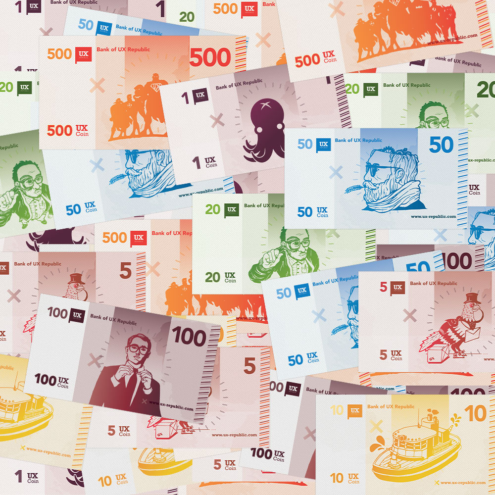

# Acheter une fonctionnalité - Erwann Blot

## I - C'est quoi ?

C'est un jeu de conception qui permet de voir les fonctionnalités que l'équipe aimerait voir disponible dans le produit développé.

Pour ce faire il faut donner une certaine valeur à des produits à partir d'une somme d'argent définie puis acheter les fonctionnalités qui nous intéresse.

La notion d'argent est importante qcar elle permet de retenir l'attention des joueurs et donc accorder plus d'importance à l'atelier plutôt que de classer arbitrairement les fonctionnalités. Attention tout de fois à bien utiliser un nom de monnaie fictive pour éviter que le joueur ne confonde la valeur estimée et le coût de réalisation.

Le jeu est fait pour 3 à 5 personnes pour une durée maximal d'1 heure 30 (cela dépend de la taille de la liste de fonctionnalité).

Les fonctionnalités reçoivent un prix en fonction de la complexité et du temps de réalisation de cette dernière (on peut s'aider d'un planning poker pour cette étape).

Chaque joueur reçoit ensuite une quantité X d'argent à dépenser ( une variante existe avec de l'argent mais pour tous le groupe)

## II - Fonctionnement du jeu

Avant la partie il faut commencer par définir la liste  axées sur l'utilisateur. Il faut faire attention à la quantité de fonctionnalités choisies pour pas que le jeu dure trop longtemps. 

Il faut définir la quantité d'argent à donner (30 à 50 % du coût total). Comme dit plus haut il ne faut pas donner de nom de vraies monnaies pour ne pas confondre coût de la mise en oeuvre et coût du produit

Le jeu commance et un joueur va jouer le rôle du "marchand" cela veut dire qu'il va présenter, expliquer, vend les fonctionnalités puis encaisse l'argent.

Les fonctionnalités sont donc présentées par ordre de coût croissant. 

Si après cette présentation un joueur souhaite acheter une fonctionnalité il doit donner le montant nécéssaire pour acheter la fonctionnalité puis expliquer pourquoi il souhaite l'acheter 

Le jeu se finit lorsque les joueurs n'ont plus d'argent ou que toutes les fonctionnalités voulues on été acheter. Il peut rester de l'argent aux joueurs, ils ne sont pas obligés de tous dépenser.

La liste des fonctionnalités qui ont été achetées sont les fonctionnalités qui vont être développées

# Sources :

[Jeu de conception Acheter une fonctionnalité - Blog UX](https://www.ux-republic.com/comment-jouer-au-jeu-de-conception-acheter-une-fonctionnalite/)
