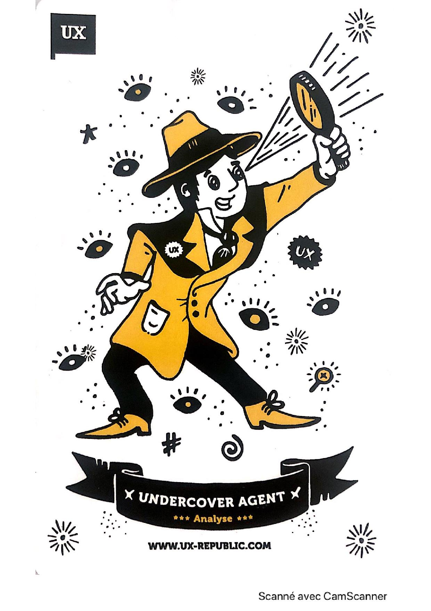
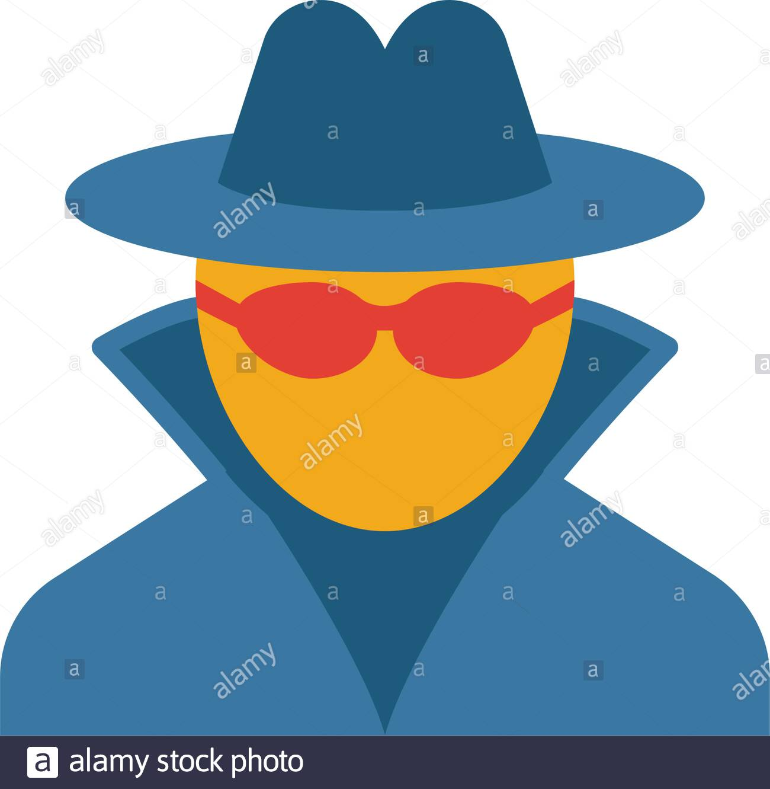

# Undercover Agent

## 1. Introduction
### 1.1 C'est quoi?
Undercover agent désigne une technique discrète d’observation des comportements réels des utilisateurs cibles, dans leur environnement naturel.
### 1.2 Context
Undercover agent (ou agent sous couverture) est une méthode ethnographique qui représente une technique d’immersion efficiente. Elle consiste à entrer en contact direct avec la personne observée, tout en portant la casquette d’un acteur qui vit la même expérience utilisateur qu’elle

 

Il s’agit d’une étude sur le terrain permettant d’observer :

* l’environnement naturel de l’utilisateur cible : son bureau, les lieux publics qu’il fréquente, à domicile, etc.
* Son mode de vie, ses relations sociales, ses pratiques et ses activités réelles.

Cette méthode peut être réalisée lors de l’analyse du public cible et pendant les tests utilisateurs (depuis l'idée du projet jusqu'à sa mise en ligne).

## 2. Analyse du fonctionnement d'Undercover Agent  

### 2.1 Comment ça se fait ?
La technique d’Undercover agent consiste à endosser le rôle d’un individu qui fait partie de la situation observée et qui peut interagir avec l’utilisateur cible, sans lui faire sentir qu’il est observé. 

Cet agent secret se déguise en client potentiel pour incarner l’utilisateur cible et réaliser le même parcours et interactions que lui. Cela favorise la collecte de données au plus près de l’observé, avec la possibilité d’influencer son expérience utilisateur.

### 2.2 Principe: 
* Lister en amont les fonctionalités à étudier 
* Préparer un scénario utilisateur 
* Dérouler le scénario en prenant des notes
Organiser et synthétiser l'ensemble des insights dans un rapport d'audit UX

## 3. Conclusion

Utile pouromprendre les usages des utilisateurs d’un produit ou service en les observant dans leur environnement naturel

* Permet d’être au plus proche de l’environnement réel des utilisateurs

* Donne accès à des insights riches et inconscients

* Efficace pour identifier les besoins non adressés

* Permet une empathie maximale avec les utilisateurs

# 4. Sources 
[OBSERVATION TERRAIN - Blog UX](https://www.ux-republic.com/nos-offres/ux-research/offre-observations-terrain/)

[Undercover-ux-slideShare](https://fr.slideshare.net/benpeck/undercover-ux)

