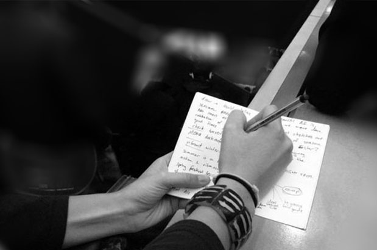

# UX - Fly on the wall

### Nathan Brégaint

# Objectif

Fly on the wall est une technique d'observation et d'analyse en UX Design en écoutant et regardant.

Elle consiste à observer l'utilisateur dans l'usage du produit en discrétion. Le principe repose sur un observateur qui se fond dans le contexte naturel d'utilisation du produit sans se faire remarquer par les utilisateurs. Le but est de ne pas interférer ou de biaiser l'utilisation du produit par l'utilisateur.

Cependant, contrairement à la méthode "Shadowing" qui consiste à suivre ce dernier pendant ses activités, la technique Fly on the wall repose sur un observateur, dans un espace public de préférence, statique, comme une mouche posée sur un mur, d'où son nom. Elle est à réaliser lors de la face d'analyse, pour comprendre l'utilisateur ainsi que lors des tests utilisateurs.

### Avantages :

- être au plus proche de l'utilisateur
- méthode non coûteuse et facile à mettre en œuvre
- Pas d'influence de l'observateur sur le comportements des participants

### Inconvénients :

- L'observateur ne peut pas poser de questions à l'utilisateur, et n'aura pas de réponse
- Limite d'utilisateurs étudiés car une grande importance accordé à chacun d'entre eux, résultat subjectif
- Moins de sensibilité et d'empathie envers les participants

Cette méthode permet de recueillir des données sur les interactions, les attitudes, les préférences technologiques, les habitudes, les comportements sociaux et les besoins des utilisateurs.

Les utilisateurs vont agir avec le produit et leur environnement naturellement car ils ne se sentiront pas observer par un tiers.

## Quand l'utiliser ?

 Cette méthode est à utiliser quand il s'agit d'observer plusieurs utilisateurs avec le produit ou le service dans leur environnement. Si l'environnement importe peu, et si l'on veut n'observer qu'un seul utilisateur ou une très grande quantité d'entre eux, cette méthode n'est pas conseillé.

## Sources

[La grande ourse | Fly on the wall](https://lagrandeourse.design/blog/lexique-ux/fly-on-the-wall/)

[Fly on the Wall in User Research | Think Design](https://think.design/user-design-research/fly-on-the-wall/)

[Fly on the Wall - Design Practice Methods](http://www.designpracticemethods.rmit.edu.au/human-centred-methods/fly-on-the-wall/)