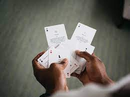
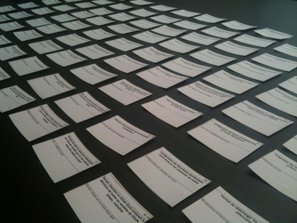
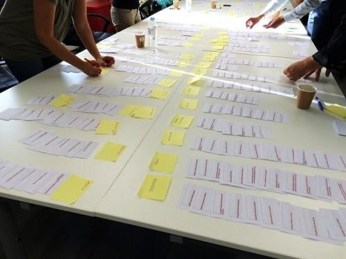

# UX   <strong style="color: #890089; text-decoration: underline;">Tri de cartes</strong>   <strong style="font-size:20px">Florian Landry</strong>

## <strong style="color:#890089">Présentation</strong>

Le tri de cartes est un outil de l'UX-design qui sert à :
* Concevoir une architecture
* Tester une architecture déjà existante
* Comprendre le schéma de pensée que peuvent avoir différents utilisateurs

Le principe est de classer des fonctionnalités, des contenus, à l'aide de cartes, au sein de catégories afin de structurer les différentes parties de notre application.

 

## <strong style="color:#890089">Préparation</strong>

Il y a deux préparations différentes suivant le type de séance que vous ferez.  
En présentiel : Il faut selectionner les quelques participants (de 4 à 8) puis les observateurs qui feront un compte-rendu.
De plus, du matériel tels que des post-it, des morceaux de papier, et des stylos seront nécessaires.  
En ligne : Il y a juste besoin d'un site de tableau blanc interactif, tel que Miro, des participants, et de quelques analystes pour utiliser les données récoltées. 

## <strong style="color:#890089">Types de tri de cartes</strong>

* Tri de cartes ouvert
* Tri de cartes fermé
* Tri de cartes inversé

### <strong style="color:#890089"><i>Tri de cartes ouvert</i></strong>

Dans cette version du tri de cartes, les participants se trouveront face aux cartes déjà créées. Celles-ci contiennent des fonctionnalités ou des contenus de l'application.  
Les participants devront ensuite classer ces cartes en formant des groupes cohérents, puis devront nommer ces derniers.  
L'utilité de ce mode et de concevoir une nouvelle architecture logicielle à partir des fonctionnalités déjà créées.  
A partir des catégories trouvées, les observateurs pourront déterminer les manières de penser des utilisateurs, ainsi trouver une structure des fonctions plus pertinentes et ergonomiques pour l'application.  

### <strong style="color:#890089"><i>Tri de cartes fermé</i></strong>

Contrairement à la précédente, ici, les participants se retrouvent à la fois face aux cartes déjà créées, mais aussi devant les groupes définis à l'avance par les organisateurs.  
Les participants doivent donc trouver quelle catégorie est la plus pertinente pour chacune des cartes.  
Cette méthode sert à s'assurer de la pertinence d'une architecture déjà définie par le passé. Et donc à vérifier s'il ne faut pas changer quelques points de celle-ci, voire même d'entièrement la recommencer.  

### <strong style="color:#890089"><i>Tri de cartes inversé</i></strong>

On termine avec cette version du tri de cartes. Comme dans la précédente, les groupes sont déjà prédéfinis. Le but des participants est de retrouver les fonctionnalités et contenus appartenant à ces groupes.  
L'utilité de cette méthode est de vérifier la facilité de repérage des utilisateurs dans l'architecture actuelle.

## <strong style="color:#890089">L'analyse des données</strong>

### <strong style="color:#890089"><i>Récupérer les données</i></strong>

La récupération des données se fait pendant et après la séance.
Pendant la séance, ce sera le comportement et le raisonnement des participants qui seront étudiés. Ainsi, les observateurs pourront remarquer s'ils ont plus ou moins de difficultés à se repérer et à naviguer au sein des différentes cartes ou catégories.  
Après la séance, ce seront les groupes et les cartes qui seront étudiés.  
Les groupes permettent de voir si les l'architecture actuelle correspond aux besoins de l'utilisateur.  
Les cartes, quant à elle, sont là pour valider les fonctionnalités de l'application.

## <strong style="color:#890089">Personnel requis</strong>

* 4 à 8 participants en présentiel, + des observateurs (de 2 à 4)
* Peu importe si l'activité est faite en ligne 

## <strong style="color:#890089">Bibliographie</strong>

<a href="https://www.usabilis.com/tri-par-cartes-une-architecture-de-linformation-construite-par-les-utilisateurs/">Usabilis</a>

<a href="https://www.ux-republic.com/nos-offres/ux-research/offre-tri-de-cartes/">UX-Republic</a>

<a href="https://tecfa.unige.ch/tecfa/maltt/ergo/articles/P2/tri_de_cartes_(Lallemand2016).pdf">Tecfa</a>

<a href="https://blog-ux.com/tri-de-cartes-ux-ou-tri-par-cartes-ux-une-methode-de-conception-centree-utilisateurs-2/">Blog UX</a>