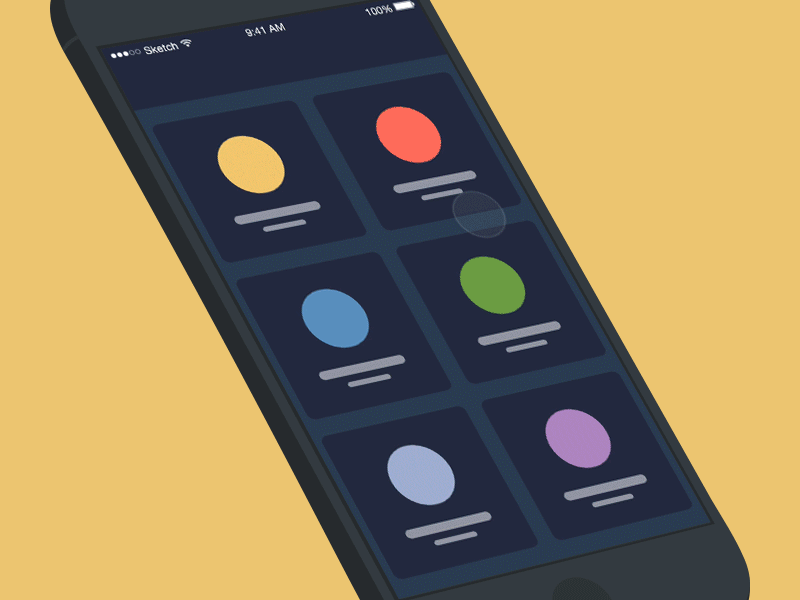
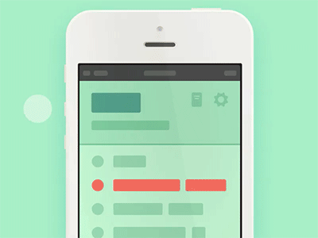
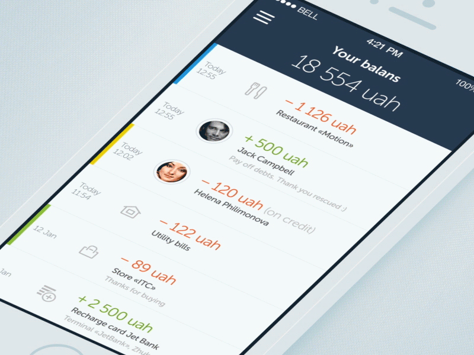
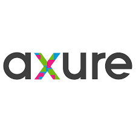
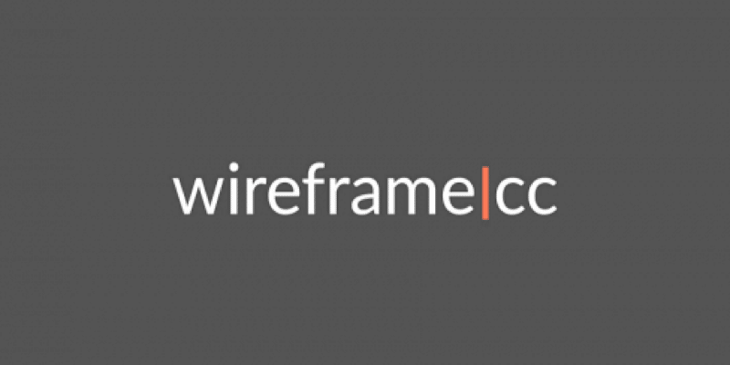

# Prototype Interactif ~ Nicolas Mary *** Conception ***

## 📜 Introduction
Le prototype interactif est un prototype qui offre des interactions (clicks, drag and drop, formulaires, certaines animations etc.) et qui permet donc de simuler les usages futur d’un produit.  
Cela permet de mieux se rendre compte du rendu final mais également de pouvoir faire tester le prototype à des utilisateurs avant même d’avoir commencé le développement.  
Le prototype interactif est l’un des prototypes les plus avancés et les plus complets, en comparaison avec les wireframes ou les maquettes qui n’offrent que du contenu statique.
  

  

## 🎯 Objectif
Mettre au point les interactions complexes et les enchaînements d'écrans.
  

## ✅ Avantages
<ul>
    <li>Favorise la définition du périmètre du projet</li>
    <li>Avoir un retour des utilisateurs avant le début du développement</li>
    <li>S'approcher au maximum des attentes et besoins des futurs utilisateurs</li>
    <li>Corriger ou valider des choix techniques ou fonctionnels avant le début du développement</li>
</ul>
&#9888;&#65039; Il est plus coûteux de faire des changements dans le code plutôt que dans la conception ! &#9888;&#65039;
  

## 🔑 Étapes clées de réalisation
### 1️⃣ Le zoning  
Le zoning est une phase de préparation qui va servir à lister et prioriser les différents éléments qui seront constitutifs de l’interface utilisateurs. C’est une schématisation dans les grandes lignes de ce que sera le projet. Cette première brique est essentielle à un travail de prototypage cohérent.  
  

### 2️⃣ Le wireframe 
C’est une représentation statique de l’interface de l'application. On cherche à décrire les bases du site notamment à savoir ce qu'il contient, les informations qu'il présente et la manière dont il les met en avant.  
Il est également conseillé de créer plusieurs wireframes pour les différentes tailles d'écran, en commençant par le "mobile first".
  
  

### 3️⃣ Le Prototypage 
Le prototype est une représentation dynamique. C’est l’étape qui permet de tester la solution conçue. Elle se réalise en se basant sur les étapes précédentes, mais cette fois-ci, on ajoute toutes les intéractions nécessaires.
  
  

### 4️⃣ L'intégration des travaux de design 
Pour terminer, on peut ajouter au prototype interactif les travaux réalisés par les designers. On s'approchera alors au maximum de la version développée. 
Cela offre une vision très précise du produit final à produire.  
  

Le prototype interactif à une notion de fidélité. Un prototype peut être de basse fidélité ou de haute fidélité.  
Si l'on souhaite avoir un prototype se rapprochant au maximum de la version final (liens fonctionnels, texts et images finales etc.), on s'oriente vers un prototype de haute fidélité.

## ⛽ Ressources requises
<ul>
    <li>1 expert</li>
    <li>1 logiciel de prototypage interactif</li>
    <li>1 à 2 semaines de travail</li>
</ul>
 

## 🛠️ Outils de prototypage interactif
La majorité des outils de prototypage proposent des versions gratuites. En revanche, pour avoir la possibilité d'utiliser pleinement ces logiciels, il faut généralement acheter une licence.  
Voici quelques exemples d'outils permettant la création de prototypes interactifs :   
 Adobe XD  
 Axure  
 balsamiq  
 MockingBird  
 UXPin  
 Wireframe cc
  

## 📚 Sources

https://www.arquen.fr/ux-design/prototype-interactif/  
https://www.sdlv.fr/blog/ui-design/wireframe-prototype-maquette-site  
https://helpx.adobe.com/fr/xd/help/create-prototypes.html  
https://www.sdlv.fr/blog/ui-design/wireframe-prototype-maquette-site  
https://bemobee.com/pourquoi-faire-un-prototype-avant-de-developper-votre-application-mobile/  
https://graphiste.com/blog/logiciel-prototypage-maquette-web  